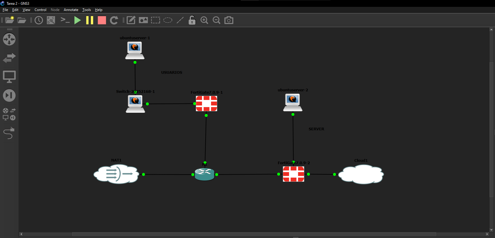
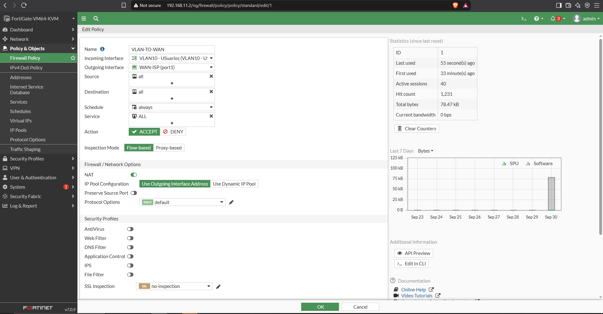

# Práctica #2 — Topología #1: VPN Site-to-Site con FortiGate

## Descripción

Implementación de una infraestructura de red con dos FortiGate, un enlace ISP,
una red de usuarios mediante VLAN 10 y un servidor web HTTPS. La comunicación
entre la red de usuarios y el servidor se realiza mediante una VPN IPsec
Site-to-Site.

## Video Link : https://youtu.be/bPiiF1wPiOI

## Objetivos

- Configurar la infraestructura de red mediante GUI en FortiGate.
- Configurar VLAN 10 y DHCP para los usuarios.
- Configurar NAT.
- Configurar una VPN IPsec Site-to-Site entre los FortiGate.
- Implementar un servidor Web mediante HTTPS.
- Comprobar la conectividad mediante ping y traceroute.
- Comprobar que la comunicación depende del túnel VPN.

## Índice

1. [Topología](#topología)
2. [Plan de direccionamiento](#plan-de-direccionamiento)
3. [Switch: VLAN 10 y trunk](#1-switch-vlan-10-y-trunk)
4. [ISP](#2-isp)
5. [FortiGate 1 (usuarios)](#3-fortigate-1-usuarios)
6. [FortiGate 2 (servidor)](#4-fortigate-2-servidor)
7. [Servidor web](#5-servidor-web)
8. [VPN IPsec Site-to-Site](#6-vpn-ipsec-site-to-site)
9. [Validación](#validación)
10. [Seguridad](#seguridad)
11. [Conclusión](#conclusión)

---

## Topología



- **Sitio 1 (usuarios):** PC de usuario → switch (VLAN 10) → **FortiGate 1 (FG1)**,
  que actúa como gateway, servidor DHCP y extremo de la VPN.
- **ISP:** router intermedio que simula Internet y conecta ambos FortiGate
  mediante enlaces WAN `/30`.
- **Sitio 2 (servidor):** **FortiGate 2 (FG2)**, gateway del servidor y extremo
  de la VPN, con el servidor web HTTPS en su LAN.

## Plan de direccionamiento

| Equipo | Interfaz | Función | Dirección |
|---|---|---|---|
| ISP | — | WAN hacia FG1 | `21.68.1.1/30` |
| FG1 | `port1` | WAN-ISP | `21.68.1.2/30` |
| FG1 | `port2` + VLAN 10 | Gateway usuarios | `10.21.68.1/25` |
| Usuario | — | VLAN 10 / DHCP | `10.21.68.10/25` |
| ISP | — | WAN hacia FG2 | `21.68.2.1/30` |
| FG2 | `port1` | WAN-ISP | `21.68.2.2/30` |
| FG2 | `port2` | LAN-SERVER | `10.21.68.129/28` |
| Servidor Web | — | HTTPS | `10.21.68.130/28` |

Subredes utilizadas:

| Red | Rango útil | Uso |
|---|---|---|
| `10.21.68.0/25` | `.1` – `.126` | Usuarios (VLAN 10) |
| `10.21.68.128/28` | `.129` – `.142` | Servidor |
| `21.68.1.0/30` | `.1` – `.2` | Enlace ISP ↔ FG1 |
| `21.68.2.0/30` | `.1` – `.2` | Enlace ISP ↔ FG2 |

---

## 1. Switch: VLAN 10 y trunk

El switch transporta la VLAN 10 entre el PC de usuario y FG1:

- `Gi0/0` es un **trunk 802.1Q** hacia FG1 que permite únicamente la VLAN 10.
- `Gi0/1` es un puerto de **acceso** en la VLAN 10 para el PC del usuario.
- Se activa `portfast` en ambos puertos para que levanten sin esperar a STP.

```text
interface GigabitEthernet0/0
 description TRUNK-HACIA-FG1
 switchport trunk allowed vlan 10
 switchport trunk encapsulation dot1q
 switchport mode trunk
 spanning-tree portfast edge trunk
!
interface GigabitEthernet0/1
 description PC-USUARIO-VLAN10
 switchport access vlan 10
 switchport mode access
 spanning-tree portfast edge
```


`show vlan brief` muestra la VLAN 10 con el puerto del usuario, y
`show interfaces trunk` confirma que el enlace hacia FG1 está en modo trunk
permitiendo la VLAN 10.

---

## 2. ISP

El ISP simula la red pública. Tiene un enlace `/30` hacia cada FortiGate
(`21.68.1.1/30` hacia FG1 y `21.68.2.1/30` hacia FG2).


`show ip interface brief` confirma que ambas interfaces están **up/up** con su IP.


`show ip route` muestra solo las redes WAN conectadas. El ISP **no conoce** las
redes privadas `10.21.68.x`, por lo que el tráfico entre usuario y servidor solo
puede llegar a destino encapsulado dentro del túnel IPsec.

---

## 3. FortiGate 1 (usuarios)

### 3.1 Interfaces

| Interfaz | Alias | IP | Notas |
|---|---|---|---|
| `port1` | WAN-ISP | `21.68.1.2/30` | Rol WAN, solo responde ping |
| `port2` | — | (trunk) | Transporta la VLAN 10 hacia el switch |
| `VLAN10 - USERS` | VLAN10 - Usuarios | `10.21.68.1/25` | VLAN ID 10 sobre `port2`, rol LAN |
| `VPN-F1-F2` | — | (túnel) | Interfaz de túnel IPsec sobre `port1` |

```text
config system interface
    edit "port1"
        set ip 21.68.1.2 255.255.255.252
        set allowaccess ping
        set alias "WAN-ISP"
        set role wan
    next
    edit "VLAN10 - USERS"
        set ip 10.21.68.1 255.255.255.128
        set allowaccess ping
        set alias "VLAN10 - USuarios"
        set role lan
        set interface "port2"
        set vlanid 10
    next
end
```


Configuración de la WAN de FG1 (`port1`) con la IP `21.68.1.2/30`.


Vista general de las interfaces de FG1: WAN, VLAN 10 y el túnel VPN.

### 3.2 VLAN 10 y servidor DHCP

La interfaz `VLAN10 - USERS` es el gateway de los usuarios (`10.21.68.1`) y tiene
un servidor DHCP que reparte direcciones de `10.21.68.10` a `10.21.68.100`.

```text
config system dhcp server
    edit 2
        set dns-service default
        set default-gateway 10.21.68.1
        set netmask 255.255.255.128
        set interface "VLAN10 - USERS"
        config ip-range
            edit 1
                set start-ip 10.21.68.10
                set end-ip 10.21.68.100
            next
        end
    next
end
```


`ip -br a` en el PC confirma que recibió su dirección por DHCP dentro de la
VLAN 10.

### 3.3 Objetos de firewall

El asistente de VPN crea los objetos que definen el tráfico que viaja por el túnel:

| Objeto | Subred | Descripción |
|---|---|---|
| `VPN-F1-F2_local` | `10.21.68.0/25` | Red de usuarios (local) |
| `VPN-F1-F2_remote` | `10.21.68.128/28` | Red del servidor (remota) |

### 3.4 Políticas de firewall

| # | Nombre | Origen → Destino | Dirección | Servicio | NAT |
|---|---|---|---|---|---|
| 1 | `VLAN-TO-WAN` | `VLAN10 - USERS` → `port1` | `all` → `all` | ALL | **Sí** |
| 2 | `vpn_VPN-F1-F2_local_0` | `VLAN10 - USERS` → `VPN-F1-F2` | local → remote | ALL | No |
| 3 | `vpn_VPN-F1-F2_remote_0` | `VPN-F1-F2` → `VLAN10 - USERS` | remote → local | ALL | No |

```text
config firewall policy
    edit 1
        set name "VLAN-TO-WAN"
        set srcintf "VLAN10 - USERS"
        set dstintf "port1"
        set action accept
        set srcaddr "all"
        set dstaddr "all"
        set service "ALL"
        set logtraffic all
        set nat enable
    next
    edit 2
        set name "vpn_VPN-F1-F2_local_0"
        set srcintf "VLAN10 - USERS"
        set dstintf "VPN-F1-F2"
        set action accept
        set srcaddr "VPN-F1-F2_local"
        set dstaddr "VPN-F1-F2_remote"
        set service "ALL"
    next
    edit 3
        set name "vpn_VPN-F1-F2_remote_0"
        set srcintf "VPN-F1-F2"
        set dstintf "VLAN10 - USERS"
        set action accept
        set srcaddr "VPN-F1-F2_remote"
        set dstaddr "VPN-F1-F2_local"
        set service "ALL"
    next
end
```


Las políticas 2 y 3 permiten el tráfico en ambos sentidos a través del túnel.
Como FortiGate bloquea todo por defecto, cada sentido necesita su política.

### 3.5 NAT

El NAT está activo **solo** en la política de salida a Internet (política 1), de
modo que los usuarios salen con la IP de la WAN (`21.68.1.2`). Las políticas de
la VPN no usan NAT para conservar las direcciones reales dentro del túnel.




### 3.6 Rutas estáticas

```text
config router static
    edit 1
        set gateway 21.68.1.1
        set device "port1"
    next
    edit 2
        set device "VPN-F1-F2"
        set dstaddr "VPN-F1-F2_remote"
    next
    edit 3
        set distance 254
        set blackhole enable
        set dstaddr "VPN-F1-F2_remote"
    next
end
```

| # | Destino | Salida | Función |
|---|---|---|---|
| 1 | `0.0.0.0/0` | `port1` vía `21.68.1.1` | Ruta por defecto hacia el ISP |
| 2 | `10.21.68.128/28` | `VPN-F1-F2` | Envía el tráfico al servidor por el túnel |
| 3 | `10.21.68.128/28` | *blackhole* (distancia 254) | Descarta el tráfico si el túnel cae |

La ruta *blackhole* es la que explica la validación **VPN desactivada**: si el
túnel baja, la ruta 2 desaparece y el tráfico hacia el servidor se descarta, en
lugar de salir por Internet sin cifrar.

---

## 4. FortiGate 2 (servidor)

### 4.1 Interfaces

| Interfaz | Alias | IP | Notas |
|---|---|---|---|
| `port1` | WAN-ISP | `21.68.2.2/30` | Rol WAN, solo responde ping |
| `port2` | LAN-SERVER | `10.21.68.129/28` | Gateway del servidor |
| `VPN-F2-F1` | — | (túnel) | Interfaz de túnel IPsec sobre `port1` |

```text
config system interface
    edit "port1"
        set ip 21.68.2.2 255.255.255.252
        set allowaccess ping
        set alias "WAN-ISP"
        set role wan
    next
    edit "port2"
        set ip 10.21.68.129 255.255.255.240
        set allowaccess ping
        set alias "LAN-SERVER"
    next
end
```


### 4.2 Objetos y políticas de firewall

| Objeto | Subred | Descripción |
|---|---|---|
| `VPN-F2-F1_local` | `10.21.68.128/28` | Red del servidor (local) |
| `VPN-F2-F1_remote` | `10.21.68.0/25` | Red de usuarios (remota) |

| # | Nombre | Origen → Destino | Dirección | Servicio | NAT |
|---|---|---|---|---|---|
| 1 | `LAN-SVR-TO-WAN` | `port2` → `port1` | `all` → `all` | ALL | **Sí** |
| 2 | `vpn_VPN-F2-F1_local_0` | `port2` → `VPN-F2-F1` | local → remote | ALL | No |
| 3 | `vpn_VPN-F2-F1_remote_0` | `VPN-F2-F1` → `port2` | remote → local | ALL | No |


Son simétricas a las de FG1. La política 3 es la que permite que los usuarios
lleguen al servidor a través del túnel.

### 4.3 Rutas estáticas

| # | Destino | Salida | Función |
|---|---|---|---|
| 1 | `0.0.0.0/0` | `port1` vía `21.68.2.1` | Ruta por defecto hacia el ISP |
| 2 | `10.21.68.0/25` | `VPN-F2-F1` | Envía el tráfico a los usuarios por el túnel |
| 3 | `10.21.68.0/25` | *blackhole* (distancia 254) | Descarta el tráfico si el túnel cae |

---

## 5. Servidor web

- Dirección IP: `10.21.68.130/28`
- Gateway: `10.21.68.129` (FG2, `port2`)
- Servicio: HTTPS/443


La captura confirma la IP `10.21.68.130/28`, dentro de la red `10.21.68.128/28`
de la LAN de FG2.

---

## 6. VPN IPsec Site-to-Site

El túnel se establece entre las IP WAN de ambos FortiGate. Cada extremo apunta
al otro como `remote-gw`, y los selectores de la fase 2 son el espejo uno del otro.

| Parámetro | FortiGate 1 | FortiGate 2 |
|---|---|---|
| Nombre del túnel | `VPN-F1-F2` | `VPN-F2-F1` |
| Interfaz | `port1` | `port1` |
| IP remota (`remote-gw`) | `21.68.2.2` | `21.68.1.2` |
| Selector local | `10.21.68.0/25` | `10.21.68.128/28` |
| Selector remoto | `10.21.68.128/28` | `10.21.68.0/25` |
| Propuesta fase 1 / fase 2 | `des-md5`, `des-sha1` | `des-md5`, `des-sha1` |
| Autenticación | PSK (no se publica) | PSK (no se publica) |

```text
config vpn ipsec phase1-interface
    edit "VPN-F1-F2"
        set interface "port1"
        set peertype any
        set proposal des-md5 des-sha1
        set remote-gw 21.68.2.2
        set psksecret <OMITIDO>
    next
end

config vpn ipsec phase2-interface
    edit "VPN-F1-F2"
        set phase1name "VPN-F1-F2"
        set proposal des-md5 des-sha1
        set src-name "VPN-F1-F2_local"
        set dst-name "VPN-F1-F2_remote"
    next
end
```

*(FG2 es equivalente, con `VPN-F2-F1`, `remote-gw 21.68.1.2` y los objetos invertidos.)*


Configuración y estado del túnel en **FG1**.


Configuración y estado del túnel en **FG2**.

> **Nota de seguridad:** se usaron las propuestas `des-md5`/`des-sha1` que trae
> el asistente en este laboratorio. DES y MD5 se consideran obsoletos; en un
> entorno real se recomienda `aes256-sha256` o superior.

---

## Validación

### VPN activa

Se verifica que el usuario pueda comunicarse con el servidor mediante:

```bash
ping 10.21.68.130
```

y:

```bash
traceroute 10.21.68.130
```

También se verifica el acceso:

```text
https://10.21.68.130
```

#### Ping con la VPN activa


El ping del usuario hacia `10.21.68.130` responde, lo que confirma que el túnel
está establecido y que las políticas permiten el tráfico.

#### Traceroute con la VPN activa


El traceroute alcanza `10.21.68.130` pasando por los FortiGate. El ISP no
aparece como salto porque el tráfico viaja encapsulado en el túnel.

#### Acceso HTTPS a través de la VPN


El navegador del usuario accede a `https://10.21.68.130` y carga el sitio del
servidor, comprobando el servicio HTTPS/443 sobre la VPN.

### VPN desactivada

Se deshabilita temporalmente el túnel IPsec y se comprueba que la
comunicación entre el usuario y el servidor deje de funcionar. Esto ocurre
porque desaparece la ruta por el túnel y la ruta *blackhole* descarta el
tráfico hacia `10.21.68.128/28`.

## Direccionamiento IP

El direccionamiento de esta práctica está basado en mi matrícula **2168**.
Se tomó `21.68` como base de todas las redes:

- Redes privadas (LAN): `10.21.68.x`
- Enlaces WAN con el ISP: `21.68.1.x` y `21.68.2.x`

| Red | Máscara | Hosts útiles | Uso |
|---|---|---|---|
| `10.21.68.0/25` | 255.255.255.128 | 126 | Usuarios (VLAN 10) |
| `10.21.68.128/28` | 255.255.255.240 | 14 | Servidor web |
| `21.68.1.0/30` | 255.255.255.252 | 2 | Enlace ISP ↔ FG1 |
| `21.68.2.0/30` | 255.255.255.252 | 2 | Enlace ISP ↔ FG2 |

| Equipo | Interfaz | Dirección |
|---|---|---|
| ISP | hacia FG1 | `21.68.1.1/30` |
| FG1 | `port1` (WAN) | `21.68.1.2/30` |
| FG1 | VLAN 10 (gateway) | `10.21.68.1/25` |
| PC Usuario | DHCP | `10.21.68.10/25` |
| ISP | hacia FG2 | `21.68.2.1/30` |
| FG2 | `port1` (WAN) | `21.68.2.2/30` |
| FG2 | `port2` (LAN) | `10.21.68.129/28` |
| Servidor Web | HTTPS | `10.21.68.130/28` |


---

## Evidencias

Todas las capturas de la práctica se encuentran en la carpeta [`img/`](img/).

## Seguridad

No se deben publicar contraseñas, PSK, claves privadas, certificados privados
ni otros secretos dentro del repositorio. Por eso los bloques de configuración
de este README son extractos con la PSK omitida, y no los archivos `.conf`
completos, que incluyen hashes de contraseñas y otros datos sensibles.

## Conclusión

La práctica permitió implementar una VPN Site-to-Site entre dos FortiGate y
comprobar la comunicación segura entre una red de usuarios y un servidor HTTPS.
También se validaron VLAN, DHCP, NAT y conectividad mediante ping y traceroute.
